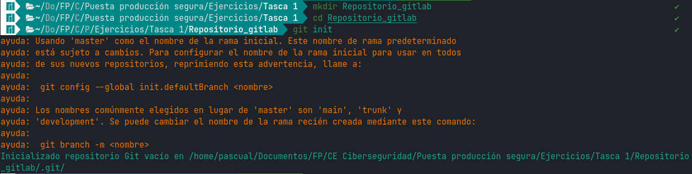
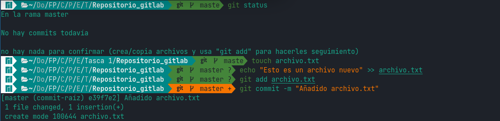
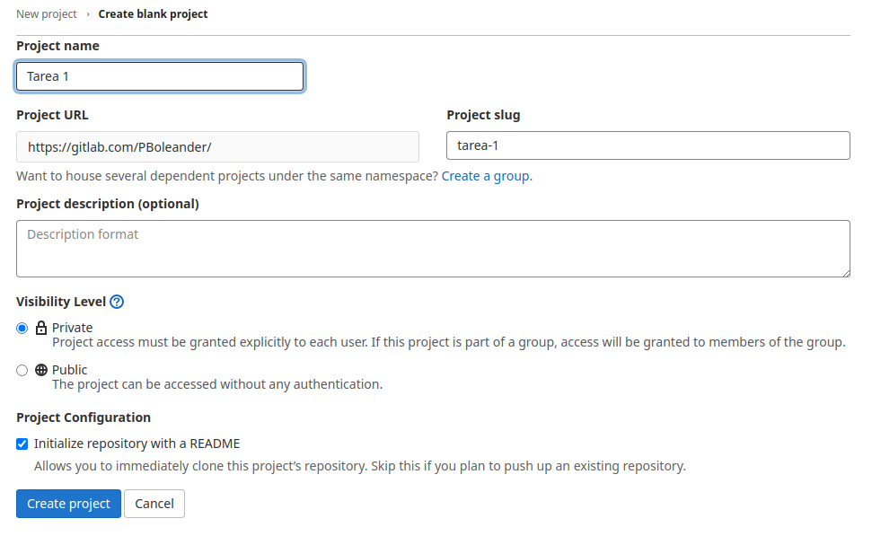
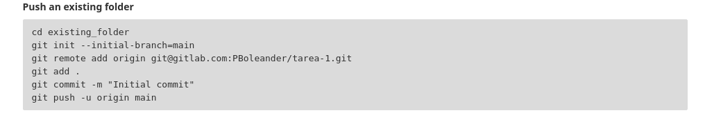
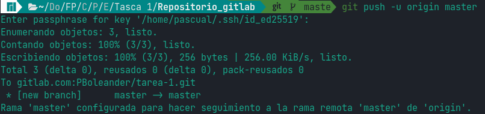
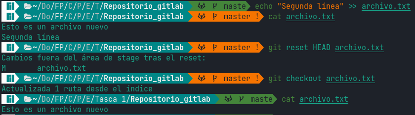
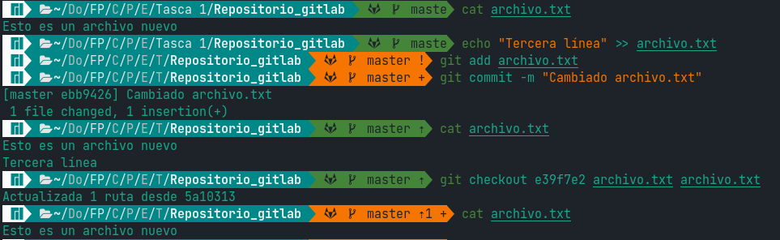

# tarea1-peps

## Pascual Barrer Ferrer

---

## Comandos básicos de Git

Primero creamos una carpeta para contener el repositorio en local e iniciamos en él git:

A continuación hacemos un `git status` (vemos que no hay nada), creamos un primer archivo y escribimos algo en él, lo añadimos a git y hacemos `commit`:

Creamos el repositorio en GitLab para tener un remoto al que subir/bajar los archivos. Le damos un nombre cualquiera y clicamos en el botón azul de crear proyecto:

En la siguiente pantalla copiamos la línea `git remote add origin...`:

y la ejecutamos en la terminal:

Ahora nuestro git local ya tiene asociado nuestro nuevo repositorio GitLab como remoto. Todos los `push` y `pull` apuntarán a ese repositorio.

Para comprobar que todo funciona podemos hacer un `push` y guardaremos los nuevos cambios en el remoto:

A continuación añadimos una segunda línea al archivo pero no añadimos el cambio a git (no lo registramos). Si ejecutamos un `reset` al HEAD seguido de un `checkout` devolveremos el archivo al estado en el que se encuentra en git. Dicho de otra manera, todos los cambios que no hayamos registrado en git se desharán como podemos ver si volvemos a mirar el archivo (sólo está la línea original):

Pero esto no se limita a recuperar la última versión guardada en git sino que se puede recuperar cualquier versión que esté registrada en git. Para comprobarlo añadiremos más cambios a nuestro archivo:

Rescatando el commit inicial a través de su hash (e39f7e2) podemos recuperar una versión en concreto. Aunque tuviéramos 100 versiones de un archivo podríamos recuperar la versión que quisiéramos.